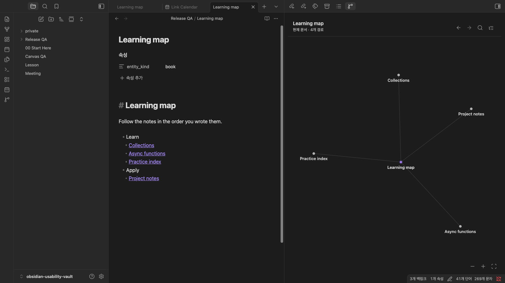
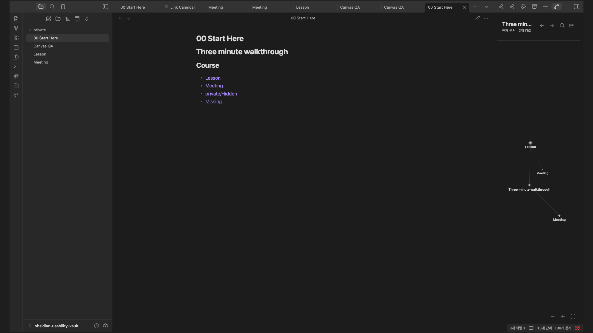

# Linked Graph Navigator

<p align="center">
  <a href="obsidian://show-plugin?id=linked-graph"></a>
  <a href="https://github.com/woonyong-kr/obsidian-linked-graph-navigator/actions/workflows/lint.yml"></a>
  <a href="https://github.com/woonyong-kr/obsidian-linked-graph-navigator/releases/latest"></a>
  <a href="LICENSE"></a>
</p>

<p align="center">
  <strong>Follow your notes in the order you wrote them.</strong>
</p>

Turn a course index, project hub, or reading list into a sidebar. Browse the links in your current note as an outline or graph, preview the next step, and open the original note.



<p align="center">
  <a href="obsidian://show-plugin?id=linked-graph">Add to Obsidian</a>
  ·
  <a href="https://github.com/woonyong-kr/obsidian-navigator-demo-vault/releases/latest">Try the public demo Vault</a>
  ·
  <a href="https://community.obsidian.md/plugins/linked-graph">Community page</a>
</p>

## Quick start: build a two-link reading path

1. Open **Settings → Community plugins → Browse**, search for **Linked Graph Navigator**, then **Install** and **Enable**.
2. Create two normal notes named `Lesson` and `Practice`. Write any sentence in each so both files exist.
3. Create a third note named `Learning map` and paste:

```markdown
# Learning map

## Start here
- [[Lesson]]
- [[Practice]]
```

4. Keep `Learning map` active. Run **Open Linked Graph Navigator for the current note** from the command palette, or select the plugin's ribbon icon.
5. You should see **Learning map** connected to **Lesson** and **Practice**. Switch to **Outline** to see Lesson before Practice under **Start here**. Select a route to open its note.

Uncreated `[[links]]` do not become routes: create their target notes first. No account, network connection, or required settings are involved.

For a ready-made walkthrough with long labels and a dense graph, download the [public demo Vault](https://github.com/woonyong-kr/obsidian-navigator-demo-vault/releases/latest).

## Where it helps

- **Course index:** keep lessons in the intended reading order and return to the next one quickly.
- **Project hub:** place design notes and implementation guides beside the current document.
- **Research trail:** preview a linked note's next links before choosing where to read.

The navigator follows the active Markdown note. It reads existing links locally, makes no network requests, and does not generate a second map or rewrite your notes.

## From note to next step

1. **Open a linked note.** The sidebar follows the active Markdown editor automatically.
2. **See the intended routes.** Only resolved outgoing links appear; unrelated Vault connections stay out of the way.
3. **Preview the next step.** Hover or keyboard-focus a route to reveal its next outgoing links.
4. **Continue in Markdown.** Click once to open the original note. Back and Forward retrace only this session's path.

There is no relationship database or saved graph layout. Disable the plugin and every link remains exactly where you wrote it.

## Graph and Outline

The graph is for spatial scanning and direct manipulation:

- drag any primary node after the pointer crosses a deliberate movement threshold;
- pan the background, use the wheel or controls to zoom, and fit the current graph;
- hover movement is local, bounded, and returns smoothly to its origin;
- a completed drag becomes the node's position for this session, while cancel or focus loss restores the previous position;
- node colours use existing canonical metadata only; titles never infer type.



These screenshots use plugin 1.6.9 in a public sample Vault in Obsidian 1.13.7 (September 8, 2026). The graph and keyboard-preview views are unchanged in 1.6.11; saved display preferences are explained below.

The Outline preserves reading order:

- links remain grouped under the section where they were written;
- search matches route titles and section context;
- plain bullet text can label a group without becoming a graph node;
- the full list remains available when a dense graph is visually bounded.

Keyboard flow: run **Focus route search**, type a route or section name, press `Arrow Down` to focus the first match, then press `Enter` to open it.

### Display preferences

Graph is the initial view; choosing Outline is remembered across restarts. Search text, expanded groups, and dragged node positions last only for the current session.

Under the plugin's settings, **Excluded folders** and **Excluded statuses** accept one entry per line:

- Default folder exclusions: `private`, `_sources`, `_generated`, `generated`, `archive`, `archived`.
- Default status exclusions: `archived`, `retired`, `superseded`, read from `status`, `lifecycle`, or `lifecycle_status`.
- A folder name matches any path segment; `Work/Archive` matches that path from the Vault root. Edit or clear these lists to include those ordinary folders or statuses.
- Dot-prefixed internal roots remain hidden even when the lists are empty. Unresolved links and non-Markdown destinations still cannot become routes.

An empty navigator reports excluded and unresolved links separately, so you can distinguish a setting from a missing note.

## Why not the built-in Graph view?

The built-in Graph view answers “how is this network connected?” Linked Graph Navigator answers “where did I intend the reader to go next?”

| | Linked Graph Navigator | Obsidian Graph |
| --- | --- | --- |
| Scope | Active note | Vault or local neighbourhood |
| Direction | Outgoing links in written order | Connections in multiple directions |
| Layout | Focused routes and optional next-step preview | Relationship network |
| Location | Persistent sidebar navigator | Separate graph view |
| Primary action | Follow an intended reading path | Inspect connections |
| Knowledge writes | None | None |

The two views complement each other: use Graph for exploration and Linked Graph Navigator for deliberate reading paths.

## Supported Markdown

Visible routes come from resolved internal links in the active note:

```markdown
## Learn

- [[Language fundamentals]]
  - [[Functions]]
  - [[Collections#Transforming values]]

## Practice

- [Executable exercises](Exercises/README.md)
```

The parser supports wikilinks, heading and block subpaths, aliases, and relative Markdown links. It always ignores embeds, external URLs, fenced code, inline code, comments, unresolved targets, duplicate destinations, and dot-prefixed internal roots. Folder and lifecycle exclusions use the configurable defaults described under **Display preferences**. Ordinary folder names such as `brain` and `inbox` keep their normal meaning. The first H1 is used as the visible note title when available.

## Performance and limits

- Direct graph capacity adapts to the measured panel area from 12 to 120 nodes.
- A hover preview shows at most 48 next-step nodes.
- Omitted routes are reported and remain available in Outline.
- A 5,000-route parser benchmark is documented in [benchmarks](docs/benchmarks.md).
- The demo Vault includes a [130-route fallback example](https://github.com/woonyong-kr/obsidian-navigator-demo-vault/blob/main/Benchmarks/Dense%20Routes.md).

These are visual safeguards, not data loss: the source Markdown remains canonical and unchanged.

## Privacy and ownership

Linked Graph Navigator is local-first and read-only:

- it makes no network requests and includes no telemetry;
- it never creates, edits, renames, or deletes notes;
- it stores no relationship database, layout, Canvas, sidecar, or duplicated note;
- display mode and folder/status exclusions are saved in plugin settings; search, collapse, graph positions, and navigation history remain session-only;
- removing the plugin removes no knowledge.

See the detailed [UX contract](docs/ux-contract.md), [design system](docs/design-system.md), and [security policy](SECURITY.md).

## Troubleshooting

- **The navigator is empty:** confirm the active file is Markdown and its internal links resolve to files in the Vault.
- **A link is missing:** check whether the target exists, then review **Excluded folders** and **Excluded statuses**. Embeds, external URLs, code, comments, duplicate destinations, and dot-prefixed internal roots never become routes.
- **Some graph routes are omitted:** switch to Outline for the complete list or enlarge the sidebar.
- **Hover preview is empty:** the focused destination has no resolved outgoing links.
- **A node opened instead of dragging:** begin with a deliberate movement; a short press is intentionally treated as a click.
- **The root is not clickable:** parent navigation appears only when the active note has a supported `parent` wikilink in frontmatter.

## Installation and compatibility

Install from **Settings → Community plugins → Browse → Linked Graph Navigator**. Version 1.6.11 fixes the route-search command so it reveals and focuses the search field. Current release **1.6.11** supports Obsidian **1.8.0+** on desktop and mobile. Both use the same local, offline navigator; no account or server is needed.

For a manual release install, download `main.js`, `manifest.json`, and `styles.css` from the [latest release](https://github.com/woonyong-kr/obsidian-linked-graph-navigator/releases/latest) into `.obsidian/plugins/linked-graph/`, then reload Obsidian.

<details>
<summary>Earlier animated walkthrough</summary>


Recorded September 1, 2026. This walkthrough shows navigation; the later saved-preference controls are not shown. Use the current instructions above for those settings.

</details>

## Support and development

- Read the [changelog](CHANGELOG.md) and [roadmap](ROADMAP.md).
- Report a [bug or use case](https://github.com/woonyong-kr/obsidian-linked-graph-navigator/issues/new/choose).
- Review the [contributing guide](CONTRIBUTING.md) before opening a pull request.

```bash
npm ci
npm run check
npm audit --omit=dev --audit-level=high
```

`npm run check` runs ESLint, unused-code analysis, TypeScript, CSS policy checks, the production build, more than 40 focused tests, and release-media validation. Node.js 20 or later is required.

## License

[MIT](LICENSE)
