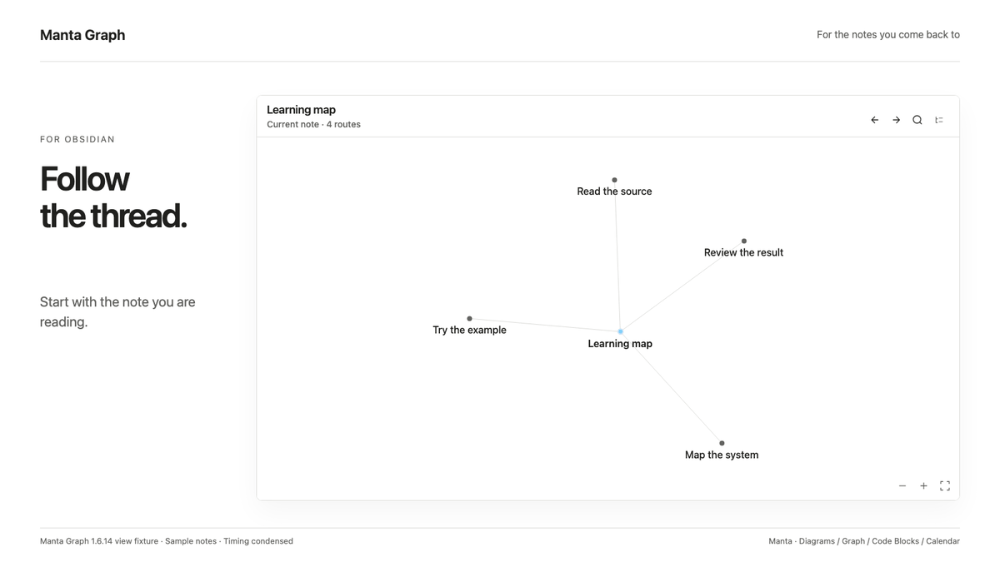

# Manta Graph

Follow your notes in the order you wrote them.

**[Install in Obsidian](https://community.obsidian.md/plugins/linked-graph) · [Try the demo Vault](https://github.com/woonyong-choi/obsidian-navigator-demo-vault/releases/latest) · [User guide](docs/user-guide.md)**

Version: **1.6.15** · Obsidian **1.8.0+** · Desktop and mobile. See [release notes](CHANGELOG.md) for shipped changes and the [roadmap](ROADMAP.md) for work in progress and plans.

<picture>
  <source media="(prefers-color-scheme: dark)" srcset="docs/assets/manta-graph-intro-dark.gif">
  
</picture>

A six-second loop of the current view using sample notes. Timing is condensed. This is a view fixture; the original Obsidian capture is below.

## Install and try

1. Open the [existing Community entry](https://community.obsidian.md/plugins/linked-graph) in Obsidian, then install and enable it.
2. Create notes named `Lesson` and `Practice`. Link to them in a third note:

```markdown
- [[Lesson]]
- [[Practice]]
```

3. Keep that note active and run **Open Manta Graph for the current note**. Select **Outline** to follow the links in their written order.

Works offline without an account. It follows existing links and does not edit your notes. Create link targets first; unresolved links do not become routes.

Manual installation: download the three plugin files from [Releases](https://github.com/woonyong-choi/manta-graph/releases/latest) into `.obsidian/plugins/linked-graph/`, then reload Obsidian.

<details>
<summary>Original runtime capture and recorded version</summary>


Obsidian desktop capture, September 11, 2026 (1.6.12), using public sample notes. The capture predates the Manta name.

</details>

## Part of the Manta family

Follow the supporting notes around a diagram, an experiment and a dated review. [Manta Diagrams](https://github.com/woonyong-choi/manta-diagrams), [Manta Code Blocks](https://github.com/woonyong-choi/manta-code-blocks), [Manta Calendar](https://github.com/woonyong-choi/manta-calendar) each work on their own. Ordinary notes and links connect the work today; automatic handoffs are planned.

**Manta itself is in development and has not been released.** I’m building it to turn source material into a personal wiki you can keep adding to. Shared AI tools and the full wiki workflow are still in development.

## Help and development

[User guide](docs/user-guide.md) · [Report a problem](https://github.com/woonyong-choi/manta-graph/issues) · [Community page](https://community.obsidian.md/plugins/linked-graph) · [Contributing](CONTRIBUTING.md)

[MIT](LICENSE)
